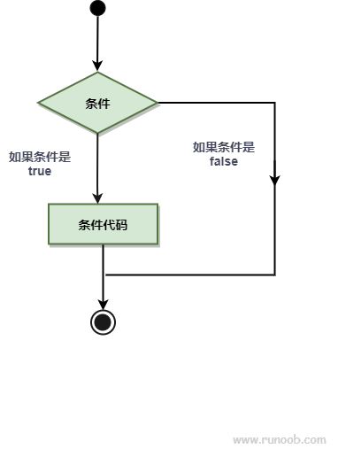
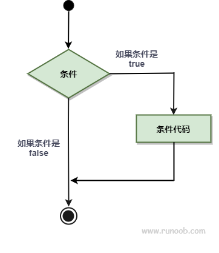
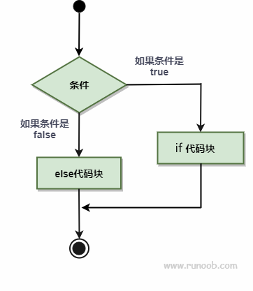
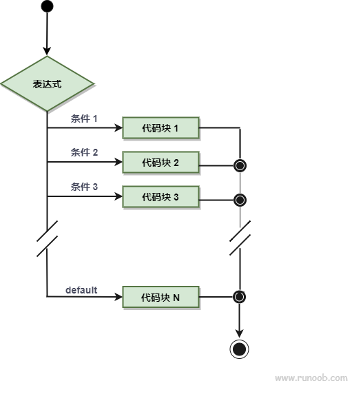

# Go 语言条件语句

---
条件语句需要开发者通过指定一个或多个条件，并通过测试条件是否为 true 来决定是否执行指定语句，并在条件为 false 的情况在执行另外的语句。

下图展示了程序语言中条件语句的结构：

Go 语言条件语句


---
Go 语言提供了以下几种条件判断语句：

|语句	| 描述                                                                                  |
|:---:|-------------------------------------------------------------------------------------|
|if 语句	| **if 语句** 由一个布尔表达式后紧跟一个或多个语句组成。                                                     |
|if...else 语句| 	**if 语句** 后可以使用可选的 **else 语句**, else 语句中的表达式在布尔表达式为 false 时执行。                     |
|if 嵌套语句| 	你可以在 **if** 或 **else if** 语句中嵌入一个或多个 **if** 或 **else if** 语句。                      |
|switch 语句	| **switch** 语句用于基于不同条件执行不同动作。                                                        |
|select 语句	| **select** 语句类似于 **switch** 语句，但是select会随机执行一个可运行的case。如果没有case可运行，它将阻塞，直到有case可运行。 |

*注意：Go 没有三目运算符，所以不支持 ?: 形式的条件判断。*

---
* ## Go 语言 if 语句

if 语句由布尔表达式后紧跟一个或多个语句组成。

**语法**
Go 编程语言中 if 语句的语法如下：
```go
if 布尔表达式 {
    /* 在布尔表达式为 true 时执行 */
}
```

If 在布尔表达式为 true 时，其后紧跟的语句块执行，如果为 false 则不执行。

流程图如下：


---
* ## Go 语言 if...else 语句
if 语句 后可以使用可选的 else 语句, else 语句中的表达式在布尔表达式为 false 时执行。

语法
Go 编程语言中 if...else 语句的语法如下：
```go
if 布尔表达式 {
    /* 在布尔表达式为 true 时执行 */
} else {
    /* 在布尔表达式为 false 时执行 */
}
```
If 在布尔表达式为 true 时，其后紧跟的语句块执行，如果为 false 则执行 else 语句块。

流程图如下：


---
* ## Go 语言 if 语句嵌套
你可以在 if 或 else if 语句中嵌入一个或多个 if 或 else if 语句。

语法
Go 编程语言中 if...else 语句的语法如下：
```go
if 布尔表达式 1 {
    /* 在布尔表达式 1 为 true 时执行 */
    if 布尔表达式 2 {
        /* 在布尔表达式 2 为 true 时执行 */
    }
}
```

你可以以同样的方式在 if 语句中嵌套 **else if...else** 语句

---
* ## Go 语言 switch 语句
switch 语句用于基于不同条件执行不同动作，每一个 case 分支都是唯一的，从上至下逐一测试，直到匹配为止。

switch 语句执行的过程从上至下，直到找到匹配项，匹配项后面也不需要再加 break。

switch 默认情况下 case 最后自带 break 语句，匹配成功后就不会执行其他 case，如果我们需要执行后面的 case，可以使用 fallthrough 。

语法
Go 编程语言中 switch 语句的语法如下：
```go
switch var1 {
    case val1:
    ...
    case val2:
    ...
    default:
    ...
}
```

变量 var1 可以是任何类型，而 val1 和 val2 则可以是同类型的任意值。类型不被局限于常量或整数，但必须是相同的类型；或者最终结果为相同类型的表达式。

您可以同时测试多个可能符合条件的值，使用逗号分割它们，例如：case val1, val2, val3。
流程图：



---
* ## Go 语言 select 语句
select 是 Go 中的一个控制结构，类似于 switch 语句。

select 语句只能用于通道操作，每个 case 必须是一个通道操作，要么是发送要么是接收。

select 语句会监听所有指定的通道上的操作，一旦其中一个通道准备好就会执行相应的代码块。

如果多个通道都准备好，那么 select 语句会随机选择一个通道执行。如果所有通道都没有准备好，那么执行 default 块中的代码。

**语法**
Go 编程语言中 select 语句的语法如下：
```go
select {
    case <- channel1:
        // 执行的代码
    case value := <- channel2:
        // 执行的代码
    case channel3 <- value:
        // 执行的代码
    
        // 你可以定义任意数量的 case
    
    default:
        // 所有通道都没有准备好，执行的代码
}
```

以下描述了 select 语句的语法：

* 每个 case 都必须是一个通道
* 所有 channel 表达式都会被求值
* 所有被发送的表达式都会被求值
* 如果任意某个通道可以进行，它就执行，其他被忽略。
* 如果有多个 case 都可以运行，select 会随机公平地选出一个执行，其他不会执行。
* 否则：
    1. 如果有 default 子句，则执行该语句。
    1. 如果没有 default 子句，select 将阻塞，直到某个通道可以运行；Go 不会重新对 channel 或值进行求值。
