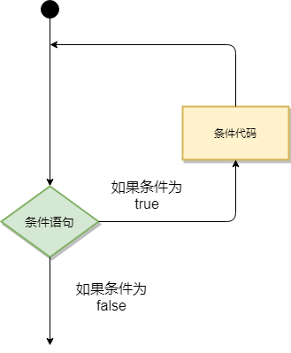
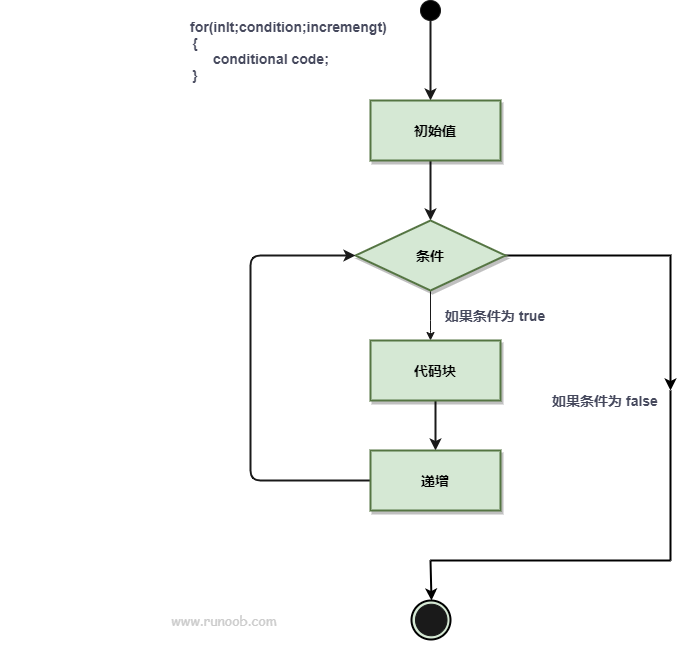
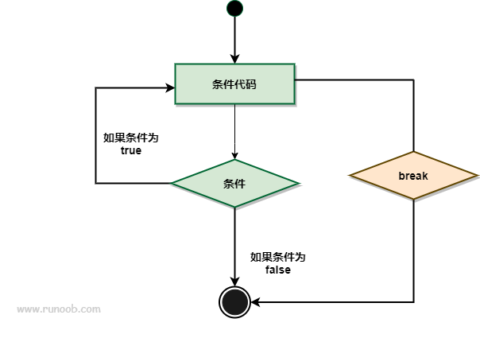
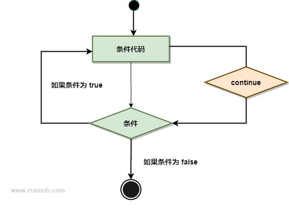
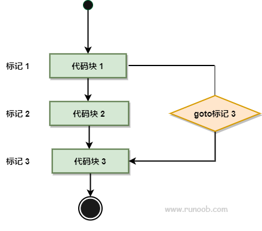

# Go 语言循环语句

---
在不少实际问题中有许多具有规律性的重复操作，因此在程序中就需要重复执行某些语句。

以下为大多编程语言循环程序的流程图：


Go 语言提供了以下几种类型循环处理语句：

| 循环类型   | 	描述                      |
|--------|--------------------------|
| for 循环 | 	重复执行语句块                 |
| 循环嵌套   | 	在 for 循环中嵌套一个或多个 for 循环 |

---
* ## 循环控制语句
循环控制语句可以控制循环体内语句的执行过程。

GO 语言支持以下几种循环控制语句：

| 控制语句        | 	描述                           |
|-------------|-------------------------------|
| break 语句    | 	经常用于中断当前 for 循环或跳出 switch 语句 |
| continue 语句 | 	跳过当前循环的剩余语句，然后继续进行下一轮循环。     |
| goto 语句	    | 将控制转移到被标记的语句。                 |

---
* ## 无限循环
如果循环中条件语句永远不为 false 则会进行无限循环，我们可以通过 for 循环语句中只设置一个条件表达式来执行无限循环：

**实例**

```go
package main

import "fmt"

func main() {
	for true {
		fmt.Printf("这是无限循环。\n")
	}
}

```

---
* ## Go 语言 for 循环
for 循环是一个循环控制结构，可以执行指定次数的循环。

**语法**

Go 语言的 For 循环有 3 种形式，只有其中的一种使用分号。

和 C 语言的 for 一样：

```go
for init; condition; post { }
```
和 C 的 while 一样：
```go
for condition { }
```
和 C 的 for(;;) 一样：
```go
for { }
```

* init： 一般为赋值表达式，给控制变量赋初值；
* condition： 关系表达式或逻辑表达式，循环控制条件；
* post： 一般为赋值表达式，给控制变量增量或减量。 

*for语句执行过程如下：*

* 1、先对表达式 1 赋初值；

* 2、判别赋值表达式 init 是否满足给定条件，若其值为真，满足循环条件，则执行循环体内语句，然后执行 post，进入第二次循环，再判别 condition；否则判断 condition 的值为假，不满足条件，就终止for循环，执行循环体外语句。

for 循环的 range 格式可以对 slice、map、数组、字符串等进行迭代循环。格式如下：
```go
for key, value := range oldMap {
    newMap[key] = value
}
```

以上代码中的 key 和 value 是可以省略。

如果只想读取 key，格式如下：
```go
for key := range oldMap
```
或者这样：
```go
for key, _ := range oldMap
```
如果只想读取 value，格式如下：
```go
for _, value := range oldMap
```
for 语句语法流程如下图所示：


---
* ## Go 语言循环嵌套
Go 语言允许用户在循环内使用循环。接下来我们将为大家介绍嵌套循环的使用。

**语法**
以下为 Go 语言嵌套循环的格式：
```go
for [condition |  ( init; condition; increment ) | Range]
{
    for [condition |  ( init; condition; increment ) | Range]
    {
        statement(s);
    }
    statement(s);
}
```

---
* ## Go 语言 break 语句
在 Go 语言中，break 语句用于终止当前循环或者 switch 语句的执行，并跳出该循环或者 switch 语句的代码块。

*break 语句可以用于以下几个方面：*

* 用于循环语句中跳出循环，并开始执行循环之后的语句。
* break 在 switch 语句中在执行一条 case 后跳出语句的作用。
* break 可应用在 select 语句中。
* 在多重循环中，可以用标号 label 标出想 break 的循环。
* 
**语法**
break 语法格式如下：
```go
break
```
break 语句流程图如下：


---
* ## Go 语言 continue 语句
Go 语言的 continue 语句 有点像 break 语句。但是 continue 不是跳出循环，而是跳过当前循环执行下一次循环语句。

for 循环中，执行 continue 语句会触发 for 增量语句的执行。

在多重循环中，可以用标号 label 标出想 continue 的循环。

**语法**
continue 语法格式如下：
```go
continue;
```
continue 语句流程图如下：


---
* ## Go 语言 goto 语句
Go 语言的 goto 语句可以无条件地转移到过程中指定的行。

goto 语句通常与条件语句配合使用。可用来实现条件转移， 构成循环，跳出循环体等功能。

但是，在结构化程序设计中一般不主张使用 goto 语句， 以免造成程序流程的混乱，使理解和调试程序都产生困难。

**语法**
goto 语法格式如下：
```go
goto label;
..
.
label: statement;
```
goto 语句流程图如下：

