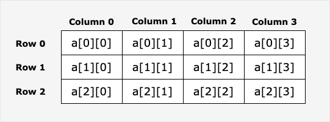

# Go 语言数组

## Go 语言提供了数组类型的数据结构。

数组是具有相同唯一类型的一组已编号且长度固定的数据项序列，这种类型可以是任意的原始类型例如整型、字符串或者自定义类型。

相对于去声明 number0, number1, ..., number99 的变量，使用数组形式 numbers[0], numbers[1] ..., numbers[99] 更加方便且易于扩展。

数组元素可以通过索引（位置）来读取（或者修改），索引从 0 开始，第一个元素索引为 0，第二个索引为 1，以此类推。

## 声明数组
Go 语言数组声明需要指定元素类型及元素个数，语法格式如下：
```go
var arrayName [size]dataType
```
其中，arrayName 是数组的名称，size 是数组的大小，dataType 是数组中元素的数据类型。

以下定义了数组 balance 长度为 10 类型为 float32：
```go
var balance [10]float32
```

## 初始化数组
以下演示了数组初始化：

以下实例声明一个名为 numbers 的整数数组，其大小为 5，在声明时，数组中的每个元素都会根据其数据类型进行默认初始化，对于整数类型，初始值为 0。

```go
var numbers [5]int
```
还可以使用初始化列表来初始化数组的元素：
```go
var numbers = [5]int{1, 2, 3, 4, 5}
```
以上代码声明一个大小为 5 的整数数组，并将其中的元素分别初始化为 1、2、3、4 和 5。

另外，还可以使用 := 简短声明语法来声明和初始化数组：
```go
numbers := [5]int{1, 2, 3, 4, 5}
```
以上代码创建一个名为 numbers 的整数数组，并将其大小设置为 5，并初始化元素的值。

***注意***：在 Go 语言中，数组的大小是类型的一部分，因此不同大小的数组是不兼容的，也就是说 [5]int 和 [10]int 是不同的类型。

以下定义了数组 balance 长度为 5 类型为 float32，并初始化数组的元素：
```go
var balance = [5]float32{1000.0, 2.0, 3.4, 7.0, 50.0}
```

我们也可以通过字面量在声明数组的同时快速初始化数组：
```go
balance := [5]float32{1000.0, 2.0, 3.4, 7.0, 50.0}
```

如果数组长度不确定，可以使用 ... 代替数组的长度，编译器会根据元素个数自行推断数组的长度：
```go
var balance = [...]float32{1000.0, 2.0, 3.4, 7.0, 50.0}
```
或
```go
balance := [...]float32{1000.0, 2.0, 3.4, 7.0, 50.0}
```

如果设置了数组的长度，我们还可以通过指定下标来初始化元素：
```go
//  将索引为 1 和 3 的元素初始化
balance := [5]float32{1:2.0,3:7.0}
```
初始化数组中 {} 中的元素个数不能大于 [] 中的数字。

如果忽略 [] 中的数字不设置数组大小，Go 语言会根据元素的个数来设置数组的大小：
```go
balance[4] = 50.0
```
以上实例读取了第五个元素。数组元素可以通过索引（位置）来读取（或者修改），索引从 0 开始，第一个元素索引为 0，第二个索引为 1，以此类推。

## 访问数组元素
数组元素可以通过索引（位置）来读取。格式为数组名后加中括号，中括号中为索引的值。例如：
```go
var salary float32 = balance[9]
```
以上实例读取了数组 balance 第 10 个元素的值。

## 二维数组
二维数组是最简单的多维数组，二维数组本质上是由一维数组组成的。二维数组定义方式如下：
```go
var arrayName [ x ][ y ] variable_type
```
variable_type 为 Go 语言的数据类型，arrayName 为数组名，二维数组可认为是一个表格，x 为行，y 为列，下图演示了一个二维数组 a 为三行四列：



二维数组中的元素可通过 a[ i ][ j ] 来访问。


## 多维数组
Go 语言支持多维数组，以下为常用的多维数组声明方式：
```go
var variable_name [SIZE1][SIZE2]...[SIZEN] variable_type
```

以下实例声明了三维的整型数组：
```go
var threedim [5][10][4]int
```
